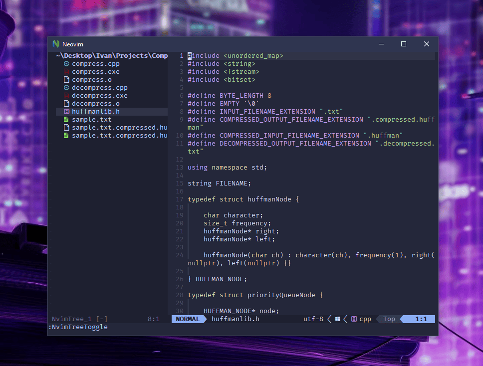

# Personalized Neovim Config

This configuration aims to enhance Neovim editing experience with a focus on performance, functionality, and aesthetics. It's heavily based on Lua for speed and leverages powerful plugins for a modern Neovim workflow.

## Resources
Here are some resources for learning Neovim's lua API:

Lua in Neovim Guide: [https://github.com/nanotee/nvim-lua-guide](https://github.com/nanotee/nvim-lua-guide)
Neovim Lua Documentation: [https://neovim.io/doc/user/lua-guide.html](https://neovim.io/doc/user/lua-guide.html)
Vim Awesome (for plugin ideas): [https://vim.rtorr.com/](https://vim.rtorr.com/)

## Installation

1. **Prerequisites:** Ensure you have Neovim version 0.5 or later.
2. **Clone this repository:** Place it in your Neovim config directory (e.g., `~/AppData/Local/nvim-data/` on Windows).
3. **Install Plugins:** Use your preferred plugin manager (this example uses vim-plug).
    a. Open your `init.vim` (or equivalent) file.
    b. Add the plugin list between `call plug#begin()` and `call plug#end()`.
    c. Run `:PlugInstall` inside Neovim.

## Key Plugins

### Themes:
    * catppuccin: For a beautiful and calming colorscheme.

### Interface:
    * nvim-tabline: Enhanced tabline.
    * lualine.nvim: Customizable and informative status line.
    * nvim-web-devicons: File type icons.

### Navigation:
    * nvim-tree.lua: File explorer.
    * telescope.nvim: Fuzzy finding for files, buffers, commands, and more.
    
### Syntax and Code:
    * nvim-treesitter: Advanced syntax highlighting and code actions.
    * nvim-autopairs: Automatic pairing of brackets, quotes, etc.
    * indent-blankline.nvim: Visual guides for indentation.

### Completion and Snippets:
    * nvim-lspconfig: Language Server Protocol support.
    * nvim-cmp + related plugins: Powerful completion framework.
    * LuaSnip:  Flexible snippet engine.
    * symbols-outline.nvim:  Outline of functions and symbols.

## Important Notes

* Visit the README files of each plugin for detailed configuration options and usage.
* Consider installing plugins gradually to avoid overwhelming Neovim and identify any potential issues easily.
* Download language servers separately based on your programming languages (e.g., Pyright for Python).

## Customization

This configuration provides a robust foundation. Adapt it to your preferences by:

* Explore other themes.
* Tweak them to match your workflow.
* Find more plugins that suit your needs.
